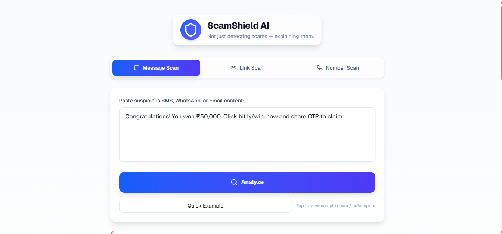
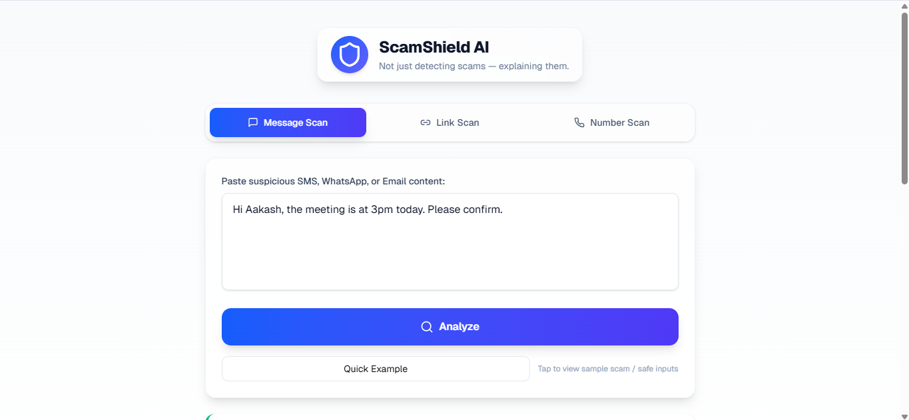
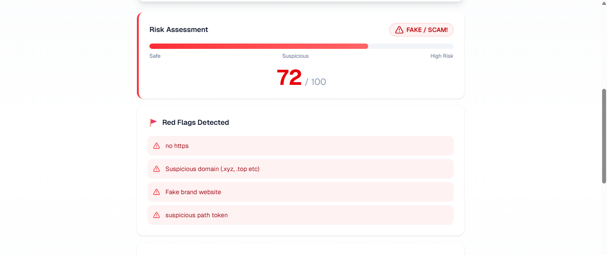
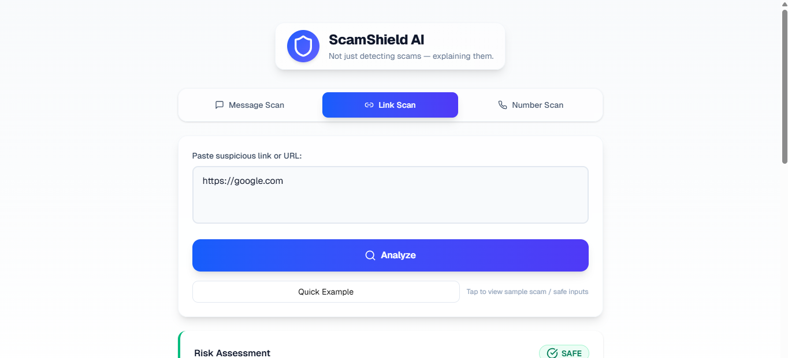
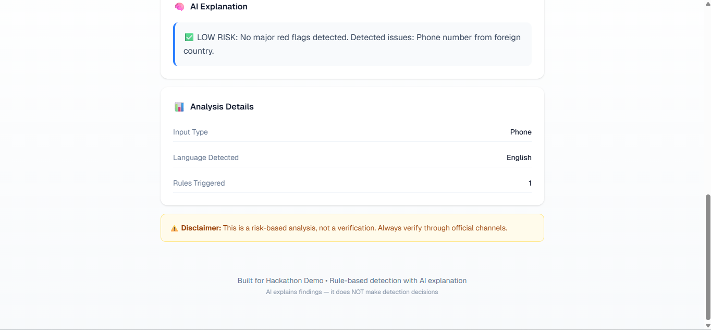
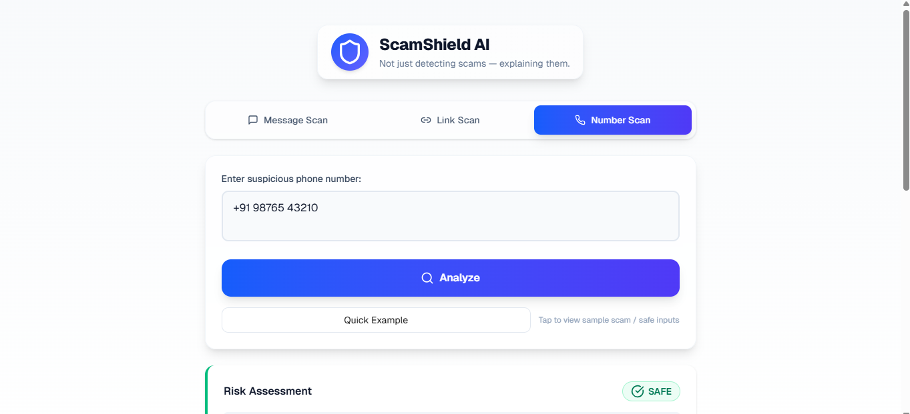

# ScamShield AI

ScamShield AI is an explainable, rule-based scam and phishing detection system with an AI-powered explanation layer. It analyzes messages, links, and phone numbers to identify common scam patterns such as urgency cues, OTP/KYC requests, brand impersonation, suspicious URLs, and abnormal phone number formats. Detection is fully rule-based and deterministic. AI (Gemini) is used only to explain the risk, never to decide it.

## Why ScamShield AI?

Online scams are increasing rapidly through SMS and WhatsApp messages, phishing emails, fake links and shortened URLs, and unknown or spoofed phone numbers. Most existing tools act as black boxes, are expensive or proprietary, and do not clearly explain why something is risky. ScamShield AI focuses on transparency, low cost, and explainability.
## Demo Screenshots

**Message Spam Examples:**
- 
- 
- 

**Message Safe Examples:**
- 
- 

**Link Scam Examples:**
- 
- 
- 

**Link Safe Examples:**
- 
- 

**Number Spam Examples:**
- 
- 
- 

**Number Safe Examples:**
- 
- 

**Demo Video:**
- 

## Project Overview

**Frontend:** Built with Next.js (App Router), React, and Tailwind CSS, the frontend provides a clean and interactive user interface with three dedicated scanners: Message Scan, Link Scan, and Phone Number Scan. It includes Quick Example buttons that allow you to instantly test scam and safe sample inputs.

**Backend:** Implemented in Python using Flask, the backend contains the rule-based detection logic and optionally calls Gemini for explanation generation. It provides a RESTful API that the frontend communicates with.

**AI Usage (Gemini):** The AI is used only for natural-language explanations. It receives structured metadata including risk score, flags, and input type, but never influences the detection result itself.

## Key Features

- Scan messages, URLs, and phone numbers for scam indicators
- Transparent rule-based risk scoring with clear methodology
- Risk levels clearly displayed as Safe, Suspicious, or High Risk
- AI-generated explanations in plain English
- Stateless design with no user data storage
- Low-cost AI usage with minimal token footprint
## Repository Structure

```
/ (project root)
  README.md                # Project documentation
  package.json             # Frontend dependencies
  app/                     # Next.js application
    page.tsx               # Main UI
    layout.tsx             # Layout & metadata
  lib/
    scam-analyzer.ts       # Frontend rule-based detection logic
  public/                  # Static assets and images
  backend/
    app.py                 # Flask API server
    requirements.txt       # Backend Python dependencies
    static/                # Optional backend static files
```

## Requirements

**Frontend:** Node.js v16 or later, npm or pnpm  
**Backend:** Python 3.10 or later, pip
## Backend Setup (Flask)

Navigate to the backend directory:

```bash
cd backend
```

Install dependencies:

```bash
pip install -r requirements.txt
```

Set the Gemini API key (optional but recommended). If not set, the backend will return a rule-based fallback explanation:

```bash
# Windows (PowerShell)
$env:GEMINI_API_KEY="YOUR_API_KEY"

# macOS / Linux
export GEMINI_API_KEY="YOUR_API_KEY"
```

Start the backend server:

```bash
python app.py
```

The API will run at `http://localhost:5000`.
## Frontend Setup (Next.js)

From the project root, install dependencies and start the development server:

```bash
npm install
npm run dev
```

Or with pnpm:

```bash
pnpm install
pnpm dev
```

The frontend will be available at `http://localhost:3000`.
## Using the Application

Open the frontend at `http://localhost:3000`. Select one of the three scanners: Message Scan, Link Scan, or Number Scan. Paste your input and click Analyze to view the risk score (0–100), risk level, detected red flags, and AI-generated explanation. You can also use Quick Examples to instantly load test cases.

## API Usage (Manual Testing)

You can call the backend API directly. For example:

```bash
curl -X POST http://localhost:5000/api/analyze \
  -H "Content-Type: application/json" \
  -d '{"input":"http://amaz0n-secure.xyz/login","type":"auto"}'
```

Sample response fields include: success, input_type (message, url, or phone), language, risk_score, risk_level, flags, details, and explanation.
## Design Philosophy

This project uses no black-box ML models and requires no datasets or training. It prioritizes explainability over prediction, with rules determining risk and AI explaining reasoning. The design is stateless and privacy-first.

## Security & Privacy

No user data is stored, and no messages or numbers are persisted. Environment variables are used for secrets, and the project is designed for demo and educational use. Do not commit API keys to GitHub.

## What This Project Does NOT Claim

This project does not verify whether a link is officially legitimate, does not confirm a phone number belongs to a scammer, and does not guarantee 100% accuracy. It provides risk-based analysis and explanation, not absolute verification.

## Contributing

Contributions are welcome. Please open issues for bugs or feature suggestions and submit pull requests with clear explanations. Keep detection rules documented and explainable.
License

MIT License

Copyright (c) 2026 Aakash Singh

Permission is hereby granted, free of charge, to any person obtaining a copy
of this software and associated documentation files (the "Software"), to deal
in the Software without restriction, including without limitation the rights
to use, copy, modify, merge, publish, distribute, sublicense, and/or sell
copies of the Software, and to permit persons to whom the Software is
furnished to do so, subject to the following conditions:

The above copyright notice and this permission notice shall be included in all
copies or substantial portions of the Software.

THE SOFTWARE IS PROVIDED "AS IS", WITHOUT WARRANTY OF ANY KIND, EXPRESS OR
IMPLIED, INCLUDING BUT NOT LIMITED TO THE WARRANTIES OF MERCHANTABILITY,
FITNESS FOR A PARTICULAR PURPOSE AND NONINFRINGEMENT. IN NO EVENT SHALL THE
AUTHORS OR COPYRIGHT HOLDERS BE LIABLE FOR ANY CLAIM, DAMAGES OR OTHER
LIABILITY, WHETHER IN AN ACTION OF CONTRACT, TORT OR OTHERWISE, ARISING FROM,
OUT OF OR IN CONNECTION WITH THE SOFTWARE OR THE USE OR OTHER DEALINGS IN THE
SOFTWARE.